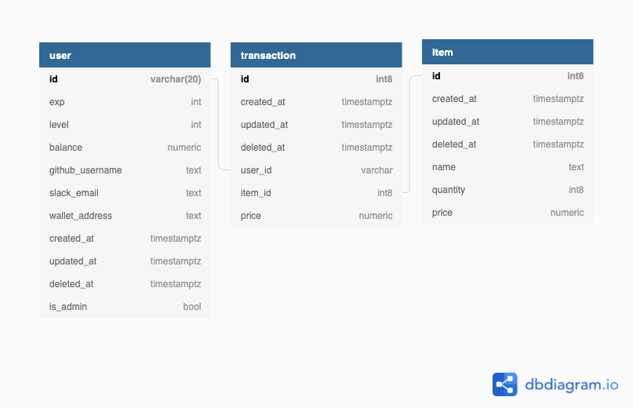

## Database schema



## Dev setup
### Commands

```shell
## copy and modify your local env
cp .env.example .env
## run base infra (postgres), this command just create a pg host and an empty database
make init 
## run server, database will be migrated when running server by using gorm.AutoMigrate in cmd/server.go
make run 
```

### Application modules

API: Server should be available at http://localhost:8080 after `make run`

Slack Bot: We need a slack bot to subscribe events / run commands on channels. You can create a slack bot by following these steps:
    1. You can use `ngrok http 8080` to establish a `public URL` from localhost to subscribe Slack events & commands
    2. Create your slack app at https://api.slack.com/apps
    3. Grant permissions in `OAuth & Permissions`:
        - channels:history
        - chat:write
        - chat:write.public
        - commands
        - groups:history
        - groups:write
        - reactions:read
        - users.profile:read
        - users:read
        - users:read.email
    4. In `Event Subscriptions`:
        4.1 Fill `Request URL` that should be https://<ngrok_public_URL>/slack/events 
        4.2 Grant permissions:
            - message.channels
            - message.groups
            - reaction_added
            - reaction_removed
    5. `Install your app` to your Slack workspace in Basic Information
    6. Gather `SLACK_TOKEN`, `SLACK_SIGNING_SECRET`, `SLACK_VERIFICATION_TOKEN` in Basic Information and update your `.env`

### Fixtures

User could be created or updated when he sends a msg to Slack channel where Slack bot is invited

